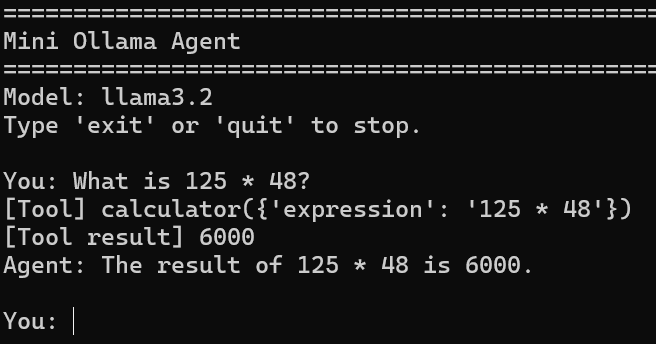

# Mini Ollama Agent

A simple AI agent built with Python and Ollama.

The agent can:
- Chat with an Ollama model
- Decide when to use a tool
- Execute a calculator tool
- Send the tool result back to the model
- Return a final natural-language answer

## Demo

## Project Structure
